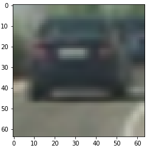
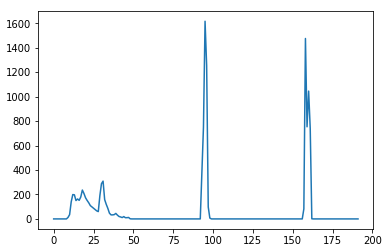
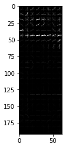
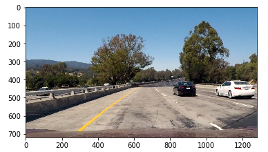
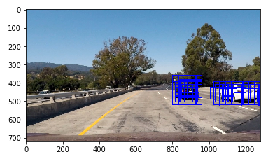
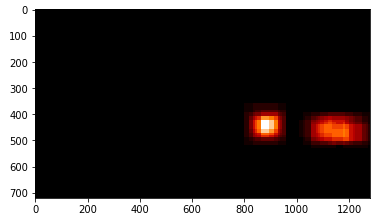
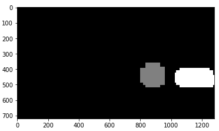
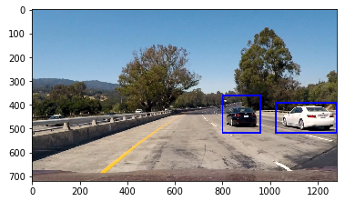

#Vehicle Detection Project

The goals / steps of this project are the following:

* Perform a Histogram of Oriented Gradients (HOG) feature extraction on a labeled training set of images and train a classifier Linear SVM classifier
* Apply a color transform and append binned color features, as well as histograms of color, to the HOG feature vector. 
* Implement a sliding-window technique and use your trained classifier to search for vehicles in images.
* Run the pipeline on a video stream and create a heat map of recurring detections frame by frame to reject outliers and follow detected vehicles.
* Estimate a bounding box for vehicles detected.

**I will present all the goals/steps with more details in the rest of this document. **

##Histogram of Oriented Gradients (HOG), Histogram color & spatial feature

####HOG
The HOG is done by `compute_hog_feature` function defined in the 4th code cell of [the iPhython Notebook](./CarND-Vehicle-Detection.ipynb)
This function is the low level and just call the `hog` function from the `skimage` package.

####Histogram
The histogram of color feature is done by `compute_color_histogram_feature` function defined in the 3rd code cell of [the iPhython Notebook](./CarND-Vehicle-Detection.ipynb). The feature is done by concatenate the histogram of the 3 channels of the image

####Spatial
The spatial feature is done by `compute_spatial_feature` function defined in the 2nd code cell of [the iPhython Notebook](./CarND-Vehicle-Detection.ipynb). The feature is just a resizing of the image and flatten the data.


###Feature extraction

I have combined the above feature extraction all together in `extract_features` function defined in the 5th code cell of [the iPhython Notebook](./CarND-Vehicle-Detection.ipynb).
This function extract the feature for one image as follow :

* Convert the image color space if not 'RGB' (YCrCb as been seleted, it gave the best results)
* Compute HOG feature on channel defined or all
* Compute color Histogram feature using bins defined
* Compute spatial feature using size defined

Then it combine all features in one big feature vector.

Here is a visual example of the features
##### Original image


##### Color Histogram


##### HOG
We don't see really much on the low half as the HOG values are really low in that channels.



## Feature parameters selection.

To select the parameters of the different features, i tried them on a set of test images and also consider the size of the feature vector and the time to extract it.

I settle down with the following setup which give a feature vector length of 12864 ( on my configuration, much more was killing my computer )
````
configuration = {
     'color_space': 'YCrCb'
    ,'hog_parameters': {
                         'orient': 8
                        ,'pix_per_cell': 8
                        ,'cell_per_block': 4
                        ,'channel': 'all'
        
    }
    ,'color_histogram_parameters': {
                                     'nbins': 64
                                    ,'bin_range': (0,255)
    }
    ,'spatial_parameters': { 'size': (32,32) }
}
````

## Classifier training.

In order to detect the cars in the image we need to classify the feature extracted between *car* cand *not car*.
The code used to train a linear classifier using Support Vector Machine (SVM) span from code cell 11 to 17 of [the iPhython Notebook](./CarND-Vehicle-Detection.ipynb).

The process is as follow:

* Extract the feature of the training set corresponding to car ( [vehicles](https://s3.amazonaws.com/udacity-sdc/Vehicle_Tracking/vehicles.zip) images)
* Extract the feature of the training set corresponding to not car ( [non-vehicle](https://s3.amazonaws.com/udacity-sdc/Vehicle_Tracking/non-vehicles.zip) images) 
* Concatenate them and generate a labels vector with value 1 for car and value 0 for not car
* Normalize the feature using `StandardScaler` from `sklearn` package
* Split the data in a training and test dataset using `train_test_split`
* Train a `LinearSVC` using the training set
* Validate the model using the test set

The accuracy of the model is 99.43%
 

##Sliding Window Search

As seen during the course, i did not implement the basic sliding window search which is really too costly in performance as we have to compute the HOG feature for each small patch that we extract from the image.
Instead i compute the HOG feature for the region of interest of the image ( mainly the low half part), then use the sliding window technique in the HOG feature coordinate.
It is implemented in `find_potential_cars_location` function from code cell 6 of [the iPhython Notebook](./CarND-Vehicle-Detection.ipynb).

The steps are as follow:

* Crop the image to the region of interest
* Convert image to the color space if not 'RGB'
* Compute a scaling factor between the window size and the size used with our classifier
* Resize the image based on the scale
* Compute the hog feature for all channels
* Loop on the windows in the HOG coordinate which is based on the block coordinate using a 2 HOG cells step which play the role of overlap in the normal window sliding search.
	* Extract HOG feature based on this coordinate
	* Compute the pixel coordinate of that window
		* Extract Histogram feature
		* Extract the Spatial feature
	* Concatenate all features
	* Scale them using the scaler used during training
	* Classify the window using our trained classifier
	* Record the window if a car is predicted 


### Hot region extraction

To identify the cars i used 3 window sizes (128, 96, 48) to scan the image.
Only the low half of the image is scanned and up to 3 times the window size.

Here is an examples of the hot regions

##### Original image


##### Hot region image


## Video Implementation

Here's a [link to my video result]()


### Pipeline

The pipeline is defined in `process_image` function from the 9th code cell of [the iPhython Notebook](./CarND-Vehicle-Detection.ipynb).

The pipeline is defined as follow:

* Extract hot regions using the `find_potential_cars_location` function for 3 window sizes
* Generate a heatmap from those potential regions
* Average the heatmap over the last 5 frames to reduce effect of false postive
* Threshold the averaged heatmap to reduce further the false positive
* Label the heatmap using `scipy.ndimage.measurements.label()` to identify blobs in the heatmap
* Draw a bounding box that cover each blob detected.

Here's an example of the separate step of the pipeline

##### Hot region


##### Heatmap


##### Labeled image


##### Final result



##Discussion

The pipeline is working relatively well on the project video, but at the cost of performance. 
The current pipeline can process only 0.6FPS (on my configuration) which falls really short for real time. 
The HOG feature combined with the window search is really time consuming. If we want even better accuracy on the detection we need even more window size. Also the classifier can be improved using a CNN instead of a linear classifier.
Using neural network and deep learning like with [YOLO](https://pjreddie.com/darknet/yolo/) should lead us to better performance and accuracy.

This was still an interresting project to see how we can extract feature information without using deep learning.
